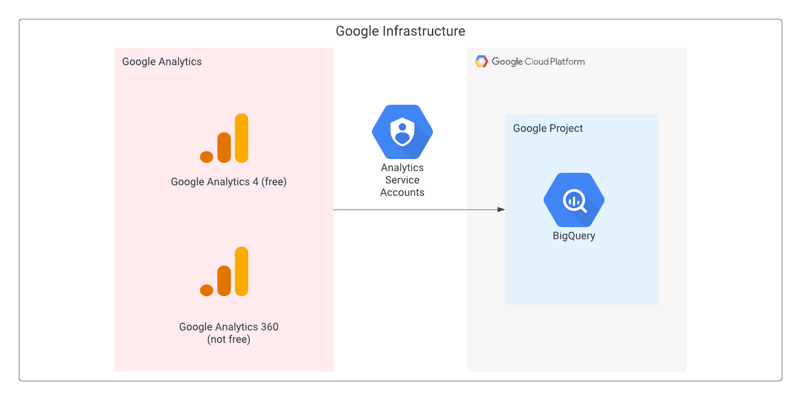

# terraform-google-analytics-360

## Description
This module will prepare a BigQuery environment to receive session and hit level data from either Google Analytics 4 (free) or Google Analytice 360 (premium) into Google BigQuery.

### Reference Architecture


The resources/services/activations/deletions that this module will create/trigger are:
- Enable Bigquery & IAM service
- Disable Organization Policy Constraint to allow GA service account to be added
- Create a custom IAM roles for GA service account and human user
- Assign GA360/GA4 Service Accounts and human users the custom IAM roles
- [Human user will follow manual instructions to link BigQuery to Google Analytics] https://support.google.com/analytics/answer/3416092?hl=en#step3&zippy=%2Cin-this-article
- Update Organization Policy Constraint variable and run Terraform again to inherit Folder or Organization constraint setting

## Usage

Basic usage of this module is as follows:

```hcl
module "analytics_360" {
  source  = "github.com/jasonbisson/terraform-google-modules/analytics-360/"
  version = "~> 0.1"
  turn_off_org_constraint = "true"
  project_id  = "<PROJECT ID>"
}
```

<!-- BEGINNING OF PRE-COMMIT-TERRAFORM DOCS HOOK -->
## Inputs

| Name | Description | Type | Default | Required |
|------|-------------|------|---------|:--------:|
| activate\_apis | The list of apis to activate within the project | `list(string)` | <pre>[<br>  "bigquery.googleapis.com",<br>  "iam.googleapis.com"<br>]</pre> | no |
| constraint | The list of constraints to disable | `string` | `"iam.allowedPolicyMemberDomains"` | no |
| description | Description of Custom role. | `string` | `"Google Analytics 360 Export Service Custom Role"` | no |
| disable\_dependent\_services | Whether services that are enabled and which depend on this service should also be disabled when this service is destroyed. https://www.terraform.io/docs/providers/google/r/google_project_service.html#disable_dependent_services | `string` | `"false"` | no |
| disable\_services\_on\_destroy | Whether project services will be disabled when the resources are destroyed. https://www.terraform.io/docs/providers/google/r/google_project_service.html#disable_on_destroy | `string` | `"false"` | no |
| enable\_apis | Whether to actually enable the APIs. If false, this module is a no-op. | `string` | `"true"` | no |
| firebase\_service\_account | The name of the Firebase service account | `string` | `"firebase-measurement@system.gserviceaccount.com"` | no |
| ga360\_service\_account | The name of the GA360 service account | `string` | `"analytics-processing-dev@system.gserviceaccount.com"` | no |
| ga\_group | The name of Google group with Analytics users that need access to Google Cloud | `string` | n/a | yes |
| project\_id | The project ID to deploy to | `string` | n/a | yes |
| sa\_permissions | IAM permissions assigned to Custom Role. | `list(string)` | <pre>[<br>  "bigquery.datasets.create",<br>  "bigquery.datasets.get",<br>  "bigquery.tables.create",<br>  "bigquery.tables.get",<br>  "bigquery.tables.delete",<br>  "bigquery.tables.updateData",<br>  "bigquery.jobs.create",<br>  "bigquery.jobs.list",<br>  "resourcemanager.projects.get"<br>]</pre> | no |
| sa\_role\_id | ID of the Custom Role. | `string` | `"GA360EXPORT_SA"` | no |
| sa\_title | Human-readable title of the Custom Role, defaults to role\_id. | `string` | `"GA360 Export Service Service Account"` | no |
| stage | The current launch stage of the role. Defaults to GA. | `string` | `"GA"` | no |
| turn\_off\_org\_constraint | Turn off Org Policy Constraint | `bool` | `true` | no |
| user\_permissions | IAM permissions assigned to Custom Role. | `list(string)` | <pre>[<br>  "resourcemanager.projects.get",<br>  "serviceusage.services.list",<br>  "serviceusage.services.enable",<br>  "resourcemanager.projects.setIamPolicy"<br>]</pre> | no |
| user\_role\_id | ID of the Custom Role. | `string` | `"GA360EXPORT_USER"` | no |
| user\_title | Human-readable title of the Custom Role, defaults to role\_id. | `string` | `"GA360 Export Service Human User"` | no |

## Outputs

No output.

<!-- END OF PRE-COMMIT-TERRAFORM DOCS HOOK -->

## Requirements

These sections describe requirements for using this module.

### Software

The following dependencies must be available:

- [Terraform][terraform] v1.3x
- [Terraform Provider for GCP][terraform-provider-gcp] plugin v3.0

### Service Account

A service account or user with the following roles must be used to provision
the resources of this module:

- Role Administrator: `roles/iam.roleAdmin`
- Organization Policy Administrator: `roles/orgpolicy.policyAdmin`
- Project IAM Admin: `roles/resourcemanager.projectIamAdmin`

### APIs

A project with the following APIs enabled must be used to host the
resources of this module:

- Google Cloud Identity & Access Management: `iam.googleapis.com`
- BigQuery: `bigquery.googleapis.com`

## Contributing

Refer to the [contribution guidelines](./CONTRIBUTING.md) for
information on contributing to this module.

[iam-module]: https://registry.terraform.io/modules/terraform-google-modules/iam/google
[project-factory-module]: https://registry.terraform.io/modules/terraform-google-modules/project-factory/google
[terraform-provider-gcp]: https://www.terraform.io/docs/providers/google/index.html
[terraform]: https://www.terraform.io/downloads.html

## Security Disclosures

Please see our [security disclosure process](./SECURITY.md).
